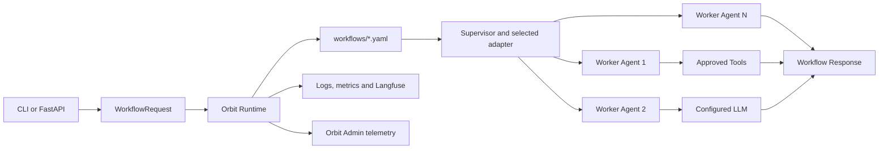

# Developer Implementation Guide

This guide explains how to turn the generated **Red Flag Detection Assistant**
baseline into a production-ready multi-agent use case powered by Orbit Core.
The generated project is intentionally deterministic: it starts without paid
provider calls, external network access, or credentials.

## Generated baseline

| Setting | Value |
|---|---|
| Project | `red-flag-detection-assistant` |
| Python package | `red_flag_detection_assistant` |
| Version | `0.1.0` |
| Execution adapter | `langgraph` |
| Python | `3.10` |
| Orbit Core | `github@main` |
| Owning team | Risk Analytics Team |
| Owner contact | risk-analytics@example.com |
| Generation mode | Uploaded use-case manifest |

The use-case team owns this repository, its prompts, agents, tools, domain
models, tests, deployment configuration, and operational support. The platform
team owns Orbit Core and its shared runtime contracts.


### Preserved manifest architecture

Initializr generated this repository from the reviewed workflow and tool
blueprint in the uploaded manifest. These are not generic example components.

#### Generated workflows


- `red_flag_detection`: starts at `retrieve_case_data`, uses
  `langgraph`, contains 3
  nodes and 2 edges, and is stored in
  `red_flag_detection_assistant/workflows/red_flag_detection.yaml`.


#### Generated agents and assignments

| Capability | Python class | Allowed tools |
|---|---|---|
| `case_data_retrieval` | `CaseDataRetrievalAgent` | `cosmos` |
| `red_flag_analysis` | `RedFlagAnalysisAgent` | None |
| `findings_persistence` | `FindingsPersistenceAgent` | `red_flag_repository` |


#### Declared tools

| Tool | Ownership | Implementation action |
|---|---|---|
| `cosmos` | `platform` | Use the Orbit Core registration; do not duplicate it |
| `red_flag_repository` | `usecase` | Implement the generated `RedFlagRepositoryTool` stub |


The generated agent `tool_names` tuples are least-privilege declarations. They
do not guess tool parameters or perform calls automatically. Implement each
approved call inside the relevant agent using `ToolRequest` and the injected
tool executor.


## Runtime architecture



Orbit resolves each workflow node's `capability` to exactly one registered
`WorkerAgent`. The agent receives a shared runtime context, a rendered prompt,
memory, the tool executor, guardrails, and the configured LLM service. Node
outputs become `previous_output` and are also available in `results` to later
agents.

## Project structure

```text
red-flag-detection-assistant/
|-- red_flag_detection_assistant/
|   |-- agents.py              # WorkerAgent implementations and AGENTS tuple
|   |-- tools.py               # Tool boundaries and approved integrations
|   |-- domain.py              # Business request, result and validation models
|   |-- composition.py         # Single registration/composition root

|   |-- workflows/             # Manifest-derived runtime workflow topologies

|   |   |-- red_flag_detection.yaml


|   |-- usecase-manifest.yaml  # Admin catalog and operational metadata
|   |-- config.py              # Typed environment configuration

|   |-- api.py                 # FastAPI health and workflow endpoints


|   |-- cli.py                 # Local command-line entry point


|   |-- onboarding.py          # Admin registration and heartbeat client


|   `-- repository.py          # Use-case-owned persistence boundary

|-- tests/                     # Deterministic unit and integration tests
|-- docs/developer-guide.md    # This implementation guide
|-- .env.example               # Configuration names without secret values
|-- pyproject.toml             # Package, runtime and test dependencies

`-- Dockerfile                 # Reproducible runtime image

```

Keep `composition.py` as the only composition root. Business modules should not
construct their own Orbit containers or copy framework source into this
repository.

## 1. Prepare the development environment

From the extracted project directory, use the Python version selected above:

```powershell
python --version
python -m venv .venv
.\.venv\Scripts\Activate.ps1
python -m pip install --upgrade pip
python -m pip install -e ".[test]"
Copy-Item .env.example .env
python -m pytest
```

The first test run must pass before business implementation begins. If the
Orbit Core dependency is private, configure the approved GitHub or Azure
Artifacts authentication outside this repository before installing. Never put
a token in `pyproject.toml`, `.env.example`, a Dockerfile, or a Git remote URL.

## 2. Design the multi-agent workflow first

Before coding, write a short responsibility table. Give each agent one business
capability and one measurable output.

| Order | Example agent | Capability | Input | Output |
|---:|---|---|---|---|
| 1 | Intake agent | `request_intake` | User task | Validated request |
| 2 | Lookup agent | `domain_lookup` | Validated request | Trusted domain facts |
| 3 | Decision agent | `decision_generation` | Facts and earlier outputs | Recommended action |
| 4 | Report agent | `response_generation` | All prior outputs | Final response |

Suggestions:

- Prefer small, specialized agents over one agent with many unrelated duties.
- Use stable lowercase capability names such as `domain_lookup`.
- Make each capability unique unless priority-based dispatch is intentional.
- Keep side effects in tools or repositories, not in prompts.
- Start with a linear workflow. Add branching only after deterministic tests
  prove each path.
- Keep nodes in topological execution order for portability across adapters.

## 3. Implement domain contracts

Start in `red_flag_detection_assistant/domain.py`. Domain models normalize input
and keep business validation independent from FastAPI, the LLM provider, and
the database.

```python
from dataclasses import dataclass


@dataclass(frozen=True, slots=True)
class SupportRequest:
    request_id: str
    question: str

    @classmethod
    def parse(cls, request_id: str, question: str) -> "SupportRequest":
        request_id = request_id.strip()
        question = question.strip()
        if not request_id or not question:
            raise ValueError("request_id and question are required")
        return cls(request_id=request_id, question=question)
```

Recommendations:

- Validate required values and size limits at the domain boundary.
- Use typed return values instead of passing arbitrary dictionaries everywhere.
- Never place API keys, database URLs, or provider clients in domain objects.
- Add a unit test for every validation rule.

## 4. Implement tools behind narrow boundaries

Orbit supports two tool types. Use a platform tool when its governed contract
already covers the integration. Create a custom tool only for use-case-specific
business behavior that the platform library does not provide.

| Tool type | Owned by | Registration | Best use |
|---|---|---|---|
| Platform tool | Orbit platform team | Automatically registered by `bootstrap()` | Shared search, database, REST, storage and platform integrations |
| Custom use-case tool | Use-case team | Explicit `registry.tool(...)` in `composition.py` | Domain APIs, business rules and use-case-specific data sources |

Both types use the same `ToolRequest`, `ToolExecutor`, guardrails, security,
observability, and `ToolResponse` contracts.

### Use an Orbit platform tool

The following tools are available from Orbit Core without importing or
registering their provider classes in the use-case repository:

| Tool name | Purpose | Request parameters | Required configuration |
|---|---|---|---|
| `search` | Tavily-compatible internet search | `query`, optional `max_results`, `search_depth` | `SEARCH_API_KEY`; optional `SEARCH_API_URL`, `SEARCH_MAX_RESULTS` |
| `postgres` | Single read-only PostgreSQL query | `query`, optional named `parameters` | `POSTGRES_HOST`, `POSTGRES_PORT`, `POSTGRES_DB`, `POSTGRES_USER`, `POSTGRES_PASSWORD` |
| `rest` | Allowlisted REST request | `action`, `url`, optional `params`, `payload` | `TOOL_ALLOWED_HOSTS` |
| `cosmos` | Read-only Cosmos DB query | `query`, optional Cosmos `parameters` | `COSMOS_ENDPOINT`, `COSMOS_KEY`, `COSMOS_DATABASE`, `COSMOS_CONTAINER` |
| `databricks` | Start a job or read run status | `action` plus `job_id` or `run_id` | `DATABRICKS_HOST`, `DATABRICKS_TOKEN` |
| `file` | Read, write or delete below an approved root | `action`, `path`, optional `content` | `TOOL_FILE_ROOT` |
| `blob` | Store or retrieve an Azure blob | `action`, `blob_name`, optional `data` | `AZURE_STORAGE_CONNECTION_STRING`, `AZURE_STORAGE_CONTAINER` |
| `web_scraping` | Read bounded text from an allowlisted page | `url` | `TOOL_ALLOWED_HOSTS`; optional size limits |

Call platform tools from an agent through the injected `tool_executor`:

```python
from orbit_core import ToolRequest


async def execute_tool(agent, runtime, tool_name: str, parameters: dict):
    runtime.state["tool_request"] = ToolRequest(
        tool_name=tool_name,
        parameters=parameters,
    )
    response = await agent.tool_executor.execute(tool_name, runtime)
    if not response.success:
        # Keep the client-facing error generic. Diagnose through sanitized logs.
        raise RuntimeError(f"{tool_name} operation failed")
    return response.data
```

Examples inside `WorkerAgent.process()`:

```python
search_results = await execute_tool(
    self,
    runtime,
    "search",
    {"query": "approved research query", "max_results": 3},
)

customer_rows = await execute_tool(
    self,
    runtime,
    "postgres",
    {
        "query": "SELECT customer_id, status FROM customers WHERE customer_id = :id",
        "parameters": {"id": customer_id},
    },
)

service_response = await execute_tool(
    self,
    runtime,
    "rest",
    {
        "action": "get",
        "url": "https://api.example.internal/orders",
        "params": {"order_id": order_id},
    },
)
```

Configure platform tools in `.env` or the deployment secret provider. List and
dictionary settings use JSON values:

```text
SEARCH_API_KEY=<secret supplied outside source control>
SEARCH_MAX_RESULTS=5
TOOL_ALLOWED_HOSTS=["api.example.internal","docs.example.internal"]
TOOL_FILE_ROOT=/app/data
TOOL_REQUIRED_ROLES={"databricks":["operator"],"file":["operator"]}
WEB_SCRAPING_MAX_BYTES=1000000
WEB_SCRAPING_MAX_CHARACTERS=20000
```

Platform-tool safety rules:

- Do not register built-in platform tools again in `composition.py`.
- Do not allow an LLM to supply arbitrary URLs, SQL, file paths, job IDs, or
  write/delete actions without deterministic validation.
- The PostgreSQL and Cosmos tools are read-only. Keep queries parameterized and
  restrict the database identity to approved schemas.
- REST and web-scraping hosts must be explicitly allowlisted. Allowlist host
  names, never user-provided URLs.
- File access is restricted below `TOOL_FILE_ROOT`; use a dedicated mounted
  directory rather than the application or secret directory.
- Databricks job runs, REST writes, file changes, and blob stores are side
  effects. Protect them with roles and any required human approval.
- Ask the platform team to extend a shared tool when several use cases need the
  same governed integration. Do not duplicate it in every repository.

### Create a custom use-case tool

Custom tools belong in `red_flag_detection_assistant/tools.py`. A tool reads its
request from `runtime.state["tool_request"]` and returns `ToolResponse`. Inject
external clients through the constructor so tests can supply fakes.

```python
from orbit_core import BaseTool, ToolMetadata, ToolResponse


class OrderLookupTool(BaseTool):
    def __init__(self, client) -> None:
        super().__init__(
            ToolMetadata(
                name="order_lookup",
                description="Reads approved order status fields.",
                capabilities=["order_lookup"],
            )
        )
        self._client = client

    async def execute(self, runtime) -> ToolResponse:
        request = runtime.state["tool_request"]
        order_id = str(request.parameters.get("order_id", "")).strip()
        if not order_id:
            return ToolResponse(success=False, error="order_id is required")

        record = await self._client.get_order(order_id)
        return ToolResponse(
            success=True,
            data={"order_id": order_id, "status": record.status},
        )
```

An agent invokes a registered tool through the injected executor:

```python
from orbit_core import ToolRequest

runtime.state["tool_request"] = ToolRequest(
    tool_name="order_lookup",
    parameters={"order_id": order_id},
)
tool_result = await self.tool_executor.execute("order_lookup", runtime)
if not tool_result.success:
    raise RuntimeError("Approved order lookup failed")
```

Tool rules:

- Register the tool in `composition.py`; do not instantiate it inside an agent.
- Use least-privilege credentials and allowlisted hosts.
- Apply timeouts and bounded response sizes in external clients.
- Return sanitized errors; do not expose credentials or raw provider payloads.
- Make read/write behavior explicit. Require approval for material side effects.
- Unit-test tools with fake clients and no real network calls.

## 5. Implement specialized agents


Implement the generated agent classes in `red_flag_detection_assistant/agents.py`.
Keep each generated `WorkerProfile.capability` aligned with the corresponding
manifest node. The generated `tool_names` tuple records the reviewed tools that
agent may use; do not broaden it without updating and reviewing the manifest.


An agent can combine a tool result with the shared LLM service:

```python
from orbit_core import ChatRequest, ToolRequest, UserMessage, WorkerAgent, WorkerProfile


class ResponseAgent(WorkerAgent):
    profile = WorkerProfile(
        capability="response_generation",
        prompt_template="response_generation",
        timeout=60,
        retry_attempts=2,
        tags=["customer-support", "response"],
    )

    async def process(self, runtime):
        order_id = runtime.prompt_variables["question"].strip()
        runtime.state["tool_request"] = ToolRequest(
            tool_name="order_lookup",
            parameters={"order_id": order_id},
        )
        lookup = await self.tool_executor.execute("order_lookup", runtime)
        if not lookup.success:
            raise RuntimeError("Order information is unavailable")

        prompt = (
            f"{runtime.state['prompt']}\n"
            f"Approved order facts: {lookup.data}"
        )
        response = await self.llm.chat(
            ChatRequest(messages=[UserMessage(content=prompt)]),
            runtime,
        )
        return response.content


AGENTS = (ResponseAgent,)
```

For later nodes, read earlier outputs from:

```python
previous_output = runtime.prompt_variables.get("previous_output", "")
all_results = runtime.prompt_variables.get("results", {})
```

Agent rules:

- Prompts describe reasoning and output requirements; Python enforces business
  validation, authorization, and irreversible actions.
- Do not create provider SDK clients directly in agents.
- Return a stable output shape that the next agent and API can understand.
- Do not log full prompts, personal data, credentials, or unrestricted tool
  responses.
- Keep an offline deterministic path for normal unit tests. Put paid live tests
  behind an explicit opt-in marker or environment flag.

## 6. Register agents, prompts, tools and workflow

Update `red_flag_detection_assistant/composition.py`. Explicit registration keeps
dependencies reviewable and makes missing capabilities, prompts, or tools fail
with a specific configuration or execution error.


The generated composition root already registers all generated agents, custom
tool stubs, prompts, and workflow files. `PLATFORM_TOOL_NAMES` is declarative:
Orbit Core bootstrap owns those implementations. Extend the existing loops;
do not create a second container or register duplicate platform tools.


```python
from pathlib import Path

from orbit_core import PromptTemplate, bootstrap

from .agents import AGENTS
from .tools import OrderLookupTool


def configure(registry):
    for agent in AGENTS:
        registry.agent(agent)

    registry.prompt(
        PromptTemplate(
            name="response_generation",
            description="Create a grounded customer response.",
            template=(
                "Answer the request using approved facts. "
                "Request: {{ question }}. "
                "Previous outputs: {{ results }}."
            ),
        )
    )
    registry.tool(OrderLookupTool(client=build_order_client()))
    registry.workflow(
        WORKFLOW_NAME,
        Path(__file__).with_name("workflow.yaml"),
    )
```

Keep client construction in this composition boundary or in a dedicated
factory called by it. Tests can pass alternate settings or fake dependencies.

## 7. Define workflow topology


The uploaded manifest produced these runtime files:


- `red_flag_detection_assistant/workflows/red_flag_detection.yaml` for `red_flag_detection`


Review and evolve these generated files. Do not replace them with the generic
`process` workflow. When topology changes, update the runtime workflow and
`usecase-manifest.yaml` in the same pull request.


```yaml
workflow:
  name: Order Support Workflow
  description: Resolve an order-support request through specialized agents.
  execution_adapter: langgraph
  start: intake
  nodes:
    - name: intake
      capability: request_intake
    - name: lookup
      capability: domain_lookup
    - name: respond
      capability: response_generation
  edges:
    - from: intake
      to: lookup
    - from: lookup
      to: respond
```

Checklist:

- `start` references an existing node.
- Every edge references existing node names.
- Every node capability has a registered agent.
- Every agent's `prompt_template` has a registered prompt.
- Nodes are declared in dependency order.
- Failure behavior is tested; a failed agent fails the workflow.
- The workflow name used by API/CLI remains `WORKFLOW_NAME` from
  `composition.py`.

## 8. Keep the Admin manifest synchronized

Whenever agents, tools, ownership, APIs, documentation, or deployment metadata
changes, update `red_flag_detection_assistant/usecase-manifest.yaml`.

The manifest workflow must mirror the corresponding runtime workflow file:

```yaml
workflows:
  - name: main_workflow
    execution_adapter: langgraph
    start: intake
    nodes:
      - name: intake
        capability: request_intake
        tools: []
      - name: lookup
        capability: domain_lookup
        tools:
          - order_lookup
      - name: respond
        capability: response_generation
        tools: []
    edges:
      - source: intake
        target: lookup
      - source: lookup
        target: respond
tools:
  - name: order_lookup
    description: Reads approved order status fields.
    source: usecase
    capabilities:
      - order_lookup
```

The runtime reads `workflow.yaml` or `workflows/*.yaml`; the Admin Dashboard
reads the manifest. Keeping them synchronized ensures the displayed diagram,
agent assignments, and tool catalog match real execution.

## 9. Configure the application safely

Copy `.env.example` to `.env` and define values locally. Commit only
`.env.example` with variable names and safe placeholders.


For Langfuse observability, configure approved values outside source control:

```text
LANGFUSE_PUBLIC_KEY=<local secret>
LANGFUSE_SECRET_KEY=<local secret>
LANGFUSE_HOST=<approved Langfuse endpoint>
```


For use-case persistence:

```text
DATABASE_URL=postgresql+psycopg2://<user>:<password>@<host>:<port>/<database>
```

Create application-owned repository methods and migrations. Do not store
business results in the Admin operational database.


For local Admin registration and telemetry:

```text
ORBIT_ADMIN_CLIENT_ENABLED=true
ORBIT_ADMIN_CLIENT_BASE_URL=http://127.0.0.1:8010/admin/v1
ORBIT_ADMIN_CLIENT_SERVICE_BASE_URL=http://127.0.0.1:8000
ORBIT_ADMIN_CLIENT_PUBLIC_BASE_URL=http://127.0.0.1:8000
ORBIT_ADMIN_CLIENT_ENVIRONMENT=local
ORBIT_ADMIN_CLIENT_TOKEN=
```

Use `ORBIT_ADMIN_CLIENT_PUBLIC_BASE_URL` when developers' browsers reach the
API through a different host or port than Admin uses for internal health
monitoring, such as Docker or Kubernetes ingress.

The empty token is acceptable only when the isolated local Admin API has
authentication disabled. Shared environments require the approved short-lived
credential mechanism.


## 10. Test in layers

Use deterministic tests as the default gate:

```powershell
python -m pytest
python -m pytest tests/test_workflow.py -q
python -m pytest tests/test_manifest.py -q
```

Recommended test layers:

1. **Domain tests** — parsing, validation, edge cases and output contracts.
2. **Tool tests** — fake clients, timeouts, denied input and sanitized errors.
3. **Agent tests** — fake tool/LLM responses and stable agent output.
4. **Workflow tests** — capability resolution, node order and failure paths.

5. **API tests** — health, request validation, success and safe failure mapping.


6. **Admin tests** — manifest registration, heartbeat and sanitized telemetry.

7. **Approved live tests** — real LLM/tools only when explicitly enabled.

Never make the normal CI suite depend on a real API key, paid LLM, mutable
external dataset, or public network availability.

## 11. Run the use case locally


CLI execution:

```powershell
red-flag-detection-assistant --task "Run a local workflow verification"
```


FastAPI execution:

```powershell
uvicorn red_flag_detection_assistant.api:create_app --factory --reload
```

Open Swagger at `http://127.0.0.1:8000/docs`, or invoke the workflow directly:

```powershell
$Body = @{
  task = "Run a local workflow verification"
  user_id = "developer"
  conversation_id = "local-test"
} | ConvertTo-Json

Invoke-RestMethod `
  -Method Post `
  -Uri http://127.0.0.1:8000/workflow/execute `
  -ContentType "application/json" `
  -Body $Body
```

Health checks:

```powershell
Invoke-RestMethod http://127.0.0.1:8000/health/
Invoke-RestMethod http://127.0.0.1:8000/health/ready
```


Container verification:

```powershell
docker build `
  --build-arg ORBIT_CORE_IMAGE=<approved-python-3.10-image> `
  -t red-flag-detection-assistant:local .

docker run --rm -p 8000:8000 --env-file .env red-flag-detection-assistant:local
```


## 12. Debug common implementation failures

| Symptom | Check | Resolution |
|---|---|---|
| Unknown capability | Node capability and `AGENTS` | Register one matching `WorkerAgent.profile.capability` |
| Prompt template not found | Agent profile and `composition.py` | Register the exact prompt name |
| Unknown tool | Tool metadata and composition | Register the tool before workflow execution |
| `ToolRequest not found` | Agent tool invocation | Set `runtime.state["tool_request"]` before executor call |
| Workflow start failure | Runtime workflow YAML | Make `start` reference an existing node |
| Later agent lacks context | Runtime prompt variables | Read `previous_output` or `results` |
| API returns `502` | Workflow response and application logs | Find the first failed agent/tool event; keep client error generic |
| Use case absent in Admin | Admin client settings and manifest | Enable client, verify Admin URL/environment, then restart |
| Diagram differs from runtime | Manifest and runtime workflow YAML | Synchronize both representations in one change |
| Langfuse trace missing | Observability environment | Verify keys/host without printing secret values |
| Package install fails | Python and Core reference | Use Python 3.10 and an accessible pinned Core release |

Useful commands:

```powershell
python -m pytest -x -vv
python -m compileall red_flag_detection_assistant tests
python -m pip show orbit-core
python -m pip check
```


```powershell
docker ps --filter "name=red-flag-detection-assistant"
docker logs --tail 200 <container-name>
docker inspect <container-name> --format='{{json .State.Health}}'
```


## 13. Implementation and review checklist

- [ ] Each agent has one clear capability and stable output contract.
- [ ] Workflow capabilities exactly match registered agent profiles.
- [ ] Prompts are registered centrally and contain no credentials.
- [ ] External systems are accessed only through approved tools/repositories.
- [ ] Tool permissions, allowed hosts, timeouts and response limits are defined.
- [ ] Domain, tool, agent, workflow and API tests pass offline.
- [ ] Live-provider tests are opt-in and use approved secret injection.
- [ ] Runtime workflow YAML and `usecase-manifest.yaml` describe the same topology and tool assignments.
- [ ] Health, Admin registration and workflow telemetry are visible locally.
- [ ] Logs and telemetry exclude business payloads and credentials.
- [ ] Deployment configuration, ownership, rollback and support are documented.
- [ ] Repository permissions and branch protections are approved.

## What not to change

- Do not copy or fork Orbit Core source into this use-case repository.
- Do not introduce a second orchestration framework around the Orbit runtime.
- Do not bypass the composition root, runtime telemetry, guardrails, or tool
  executor for convenience.
- Do not commit `.env`, credentials, production prompts containing sensitive
  data, model responses, database exports, or customer payloads.
- Do not remove generated health, manifest, and deterministic test foundations
  without an approved replacement.

## Definition of done

The use case is ready for release when deterministic tests pass, approved live
tests pass separately, API and container health checks are green, the Admin
Dashboard shows registration and sanitized workflow telemetry, the workflow
diagram and tool catalog match the implementation, and ownership, deployment,
secrets, monitoring, rollback, and operational support have been approved.
